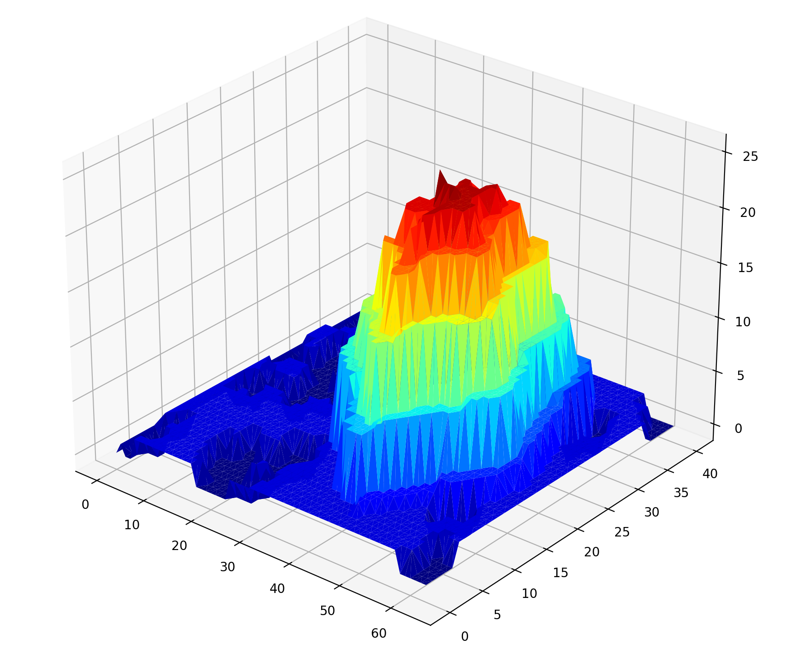

# 🎄 Advent of Code 🎄

Advent of Code is an annual set of Christmas-themed computer programming challenges that follow an Advent calendar.
The programming puzzles cover a variety of skill sets and skill levels and can be solved using any programming language.
Participants also compete based on speed on both global and private leaderboards.
See https://adventofcode.com/.

## 🌟 Highlights🌟

### 2022 - Day 12 - Hill Climbing Algorithm -Visualization

